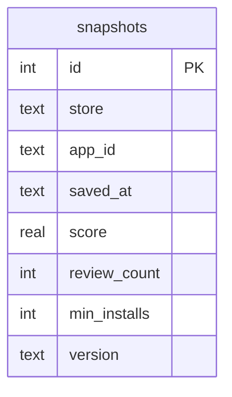

# ✨ feat: Comparison Charts, Release Detection, and Velocity Metrics

## Overview

Three shipped phases that turn App Vitals from a metric tracker into a lightweight competitive intelligence tool:

1. **Prerequisite** — extract `buildAxisFormat` + add `formatPercent` to `lib/format.ts`
2. **Comparison Charts** — replace stacked competitor cards with unified multi-app overlay charts
3. **Schema expansion** — add `version` to snapshots; detect release events
4. **Release markers + velocity** — visual release markers on charts, week-over-week velocity badges

Each phase is independently shippable and builds on the previous.

> **Cut from original scope:** Stock price overlay (Phase 3 of original plan) — deferred. Unofficial Yahoo Finance API, secondary Y-axis complexity, and need for months of data before it's meaningful make this not worth it now.

> **Deferred:** Release impact score — needs months of weekly data before the average is statistically meaningful. Revisit once a full year of snapshots exists.

---

## Phase 0: Prerequisite — `lib/format.ts` additions

Before writing any chart code, extract the shared formatting logic.

**Move `buildAxisFormat` from `components/SnapshotHistory.tsx:19-44` to `lib/format.ts`.**

`lib/format.ts` is already the home for `formatCount` and `formatDelta`. `buildAxisFormat` is pure display logic with no component dependencies — it belongs here. Import it in both `SnapshotHistory.tsx` and the new `ComparisonCharts.tsx`.

**Add `formatPercent` to `lib/format.ts`:**

```typescript
/**
 * Format a percentage delta for trend badges.
 * Examples: 2.5 → "+2.5%", -1.2 → "-1.2%", 0 → "0%"
 */
export function formatPercent(delta: number): string {
  if (delta === 0) return "0%";
  return (delta > 0 ? "+" : "") + delta.toFixed(1) + "%";
}
```

### Acceptance criteria — Phase 0

- [x] `buildAxisFormat` exported from `lib/format.ts` and imported (not copied) in `SnapshotHistory.tsx`
- [x] `formatPercent` exported from `lib/format.ts`
- [x] `__tests__/lib/format.test.ts` updated with tests for both

### Key files — Phase 0

| File | Action |
|---|---|
| `lib/format.ts` | Add `buildAxisFormat` (moved from SnapshotHistory) + `formatPercent` |
| `components/SnapshotHistory.tsx` | Replace local `buildAxisFormat` definition with import from `lib/format.ts` |
| `__tests__/lib/format.test.ts` | Add tests for `buildAxisFormat` and `formatPercent` |

---

## Phase 1: Comparison Charts

Replace the current stacked competitor `AppCard` blocks with a single `ComparisonCharts` section showing all apps' historical data as overlaid colored lines.

### What to build

**One file: `components/ComparisonCharts.tsx`.**

The single-chart SVG logic lives as a private function inside this file — following the exact same pattern as `Sparkline` inside `SnapshotHistory.tsx`. Do not create a separate `ComparisonChart.tsx` file; it would have exactly one caller and adds a file boundary with no structural benefit.

**`components/ComparisonCharts.tsx`** internals:

- `"use client"` component
- Props: `apps: { appId: string; store: "ios" | "android"; name: string; color: string }[]`
- Fetches all snapshots in parallel via `Promise.allSettled` on mount (see `parallel-fetch-orchestration-allsettled-vs-all.md` — never `Promise.all`)
- `AbortController` in `useRef` with 15s timeout (same pattern as `CompetitorTable.tsx:55`)
- Renders 4 charts: iOS Rating, iOS Reviews, Android Rating, Android Reviews
- Empty/zero-point state if an app has no snapshots — no skeleton needed

**Private `renderChart(metric, store, seriesList)` function** inside the file:

- Accepts `seriesList: { label: string; color: string; snapshots: Snapshot[] }[]`
- Uses `buildAxisFormat` from `lib/format.ts` (imported, not copied)
- **Independent Y-scaling per series** — required because Babbel ~50K reviews vs Duolingo ~2M. A shared axis makes Babbel's line invisible.
- Legend row per series: app name (brand color) + current value + trend badge using `formatDelta` + `formatPercent`
- `"scales differ"` note below legend when independent scaling is active
- Dimensions: 320×100px

**X-axis alignment:** All series must use the same time window. Collect the union of all `savedAt` dates across all series, sort them, and map each series's snapshots to those shared x-positions by date. If a series has no snapshot for a given date, interpolate or skip that point. This ensures lines are temporally aligned — a dip in one series at x=0.5 represents the same week as a dip in another series at x=0.5.

**Trend badge:** `(latest.score - prev.score)` with `formatDelta` and `formatPercent`. Shows `—` when fewer than 2 snapshots exist for a series.

**Update `components/SearchPage.tsx`**

- Remove the competitor `AppCard` render loop
- Add `<ComparisonCharts apps={allPresetApps} />` below the leading app's `AppCard`
- Only render when `selectedPreset !== null` (no snapshots exist for arbitrary custom app IDs)

### Acceptance criteria — Phase 1

- [x] `ComparisonCharts` section shows all preset apps as colored lines on 4 charts (iOS/Android × Rating/Reviews)
- [x] Only shown when a preset app is active — not for arbitrary searches
- [x] Y-axis labels use `buildAxisFormat` (imported from `lib/format.ts`)
- [x] All series share a common time-based X axis — a point at position X represents the same week for all series
- [x] Trend badge shows `↑+0.1 (+2%)` / `↓-0.1 (-2%)` / `—` (fewer than 2 snapshots)
- [x] `"scales differ"` note visible in legend when independent Y scaling is active
- [x] One app's snapshots failing to fetch does not break the others
- [x] No stacked competitor AppCards below the leading app
- [x] Tests: `__tests__/components/ComparisonCharts.test.tsx`

### Key files — Phase 1

| File | Action |
|---|---|
| `components/ComparisonCharts.tsx` | New — wrapper + private chart function, fetches all snapshots |
| `components/SearchPage.tsx` | Remove competitor AppCards, add ComparisonCharts |
| `__tests__/components/ComparisonCharts.test.tsx` | New |
| `__tests__/components/SearchPage.test.tsx` | Update — remove competitor assertions, add ComparisonCharts assertions |

---

## Phase 2: Schema Expansion

Add `version` to the snapshots table and detect release events.

### Migration strategy

**Critical:** The `snapshots` table already exists in both local dev and production with rows. `CREATE TABLE IF NOT EXISTS` does NOT add new columns. Use `ALTER TABLE ADD COLUMN` wrapped in per-column try/catch.

**Critical:** The try/catch must be OUTSIDE `client.batch()`. If these statements are placed inside the batch and fail, `client.batch()` throws, and since `_dbPromise` is assigned before the `await`, it is permanently rejected for that serverless instance. Every subsequent `getDb()` call returns the same rejected Promise until the instance recycles.

Safe pattern in `lib/db.ts`, run after the existing `CREATE TABLE IF NOT EXISTS` batch:

```typescript
// lib/db.ts — after the CREATE TABLE batch
// ALTER TABLE has no IF NOT EXISTS guard in SQLite.
// Run each migration outside the batch so a failure does not poison _dbPromise.
const columnMigrations = [
  "ALTER TABLE snapshots ADD COLUMN version TEXT",
];
for (const sql of columnMigrations) {
  try {
    await client.execute(sql);
  } catch {
    // "duplicate column name" — column already exists. Safe to ignore.
  }
}
```

### Type changes

Extend `Snapshot` in `types/app-data.ts`:

```typescript
export interface Snapshot {
  id: number;
  store: "ios" | "android";
  appId: string;
  savedAt: string;       // ISO 8601
  score: number;
  reviewCount: number;
  minInstalls?: number;  // Android only
  version: string | null; // null for rows saved before migration
  isRelease: boolean;     // computed at read time, never stored
}
```

> **Note:** `version` is `string | null`, not `string | undefined` and not optional. Old rows have `NULL` in the DB; returning `null` is semantically distinct from "field not present". This distinction matters for `isRelease` computation.

> **`price` column deliberately omitted.** No current feature consumes stored price data. The existing `AppData.price` union (`{ type: "free" } | { type: "paid"; amount; currency }`) cannot be cleanly collapsed to a single `REAL` column without losing the currency and free/paid discriminant. Defer until a specific feature needs it.

### `isRelease` computation

Computed in `getSnapshots()` after mapping rows to `Snapshot` objects (rows are already ascending by `savedAt`):

```typescript
// After mapping rows to Snapshot objects (sorted ASC):
return snapshots.map((snap, i) => ({
  ...snap,
  isRelease:
    i > 0 &&
    snap.version !== null &&
    snapshots[i - 1].version !== null &&
    snap.version !== snapshots[i - 1].version,
}));
```

**NULL rules:**
- `isRelease = false` for index 0 (no predecessor)
- `isRelease = false` if current version is `null` (row saved before migration)
- `isRelease = false` if previous version is `null` (would produce a false positive for every post-migration row)
- `isRelease = false` when consecutive Android snapshots both have `"Varies with device"` (handled correctly — they are equal strings)

### `saveSnapshot` options object

The parameter list was growing unwieldy. Switch to an options object:

```typescript
// lib/snapshots.ts
export async function saveSnapshot(
  store: "ios" | "android",
  appId: string,
  opts: {
    score: number;
    reviewCount: number;
    version: string;
    minInstalls?: number;
  },
): Promise<Snapshot>
```

`version` is required in `opts` (always present on live `AppData`) but stored as TEXT — the column accepts NULL for old rows, but new saves always have a value.

### Cron changes

`app/api/cron/snapshot/route.ts` — pass version from scraper data:

```typescript
fetchIosApp(preset.iosId).then((data) =>
  saveSnapshot("ios", preset.iosId, {
    score: data.score,
    reviewCount: data.reviewCount,
    version: data.version,
  })
),
fetchAndroidApp(preset.androidId).then((data) =>
  saveSnapshot("android", preset.androidId, {
    score: data.score,
    reviewCount: data.reviewCount,
    version: data.version,
    minInstalls: data.minInstalls,
  })
),
```

### Acceptance criteria — Phase 2

- [x] Fresh install: `version` column created automatically on first cold start
- [x] Existing install: `ALTER TABLE` migration runs without error; existing rows have `NULL` version — no `_dbPromise` death on re-runs
- [x] `saveSnapshot` accepts and stores `version`
- [x] `getSnapshots` returns `version` (string or null) and computed `isRelease`
- [x] `isRelease = false` for index 0
- [x] `isRelease = false` when either current or previous version is null
- [x] `isRelease = true` only when both versions are non-null and differ
- [x] Tests updated in `__tests__/lib/snapshots.test.ts`
- [x] Tests updated in `__tests__/api/cron/snapshot.test.ts`

### Key files — Phase 2

| File | Action |
|---|---|
| `lib/db.ts` | Add per-column ALTER TABLE migration (outside batch) |
| `lib/snapshots.ts` | Accept/save `version` via options object; compute `isRelease` |
| `types/app-data.ts` | Extend `Snapshot` with `version: string \| null` and `isRelease: boolean` |
| `app/api/cron/snapshot/route.ts` | Pass `version` to `saveSnapshot` |
| `__tests__/lib/snapshots.test.ts` | Update for new fields + isRelease computation edge cases |
| `__tests__/api/cron/snapshot.test.ts` | Update for new `saveSnapshot` signature |

---

## Phase 3: Release Markers and Velocity Badges

Surface release events and week-over-week velocity directly in the comparison charts. No separate analytics page for now — velocity and release data live inline where the chart data already is.

### Release markers on charts

In `components/ComparisonCharts.tsx`, for the leading app's series:

- For each snapshot where `isRelease === true`, render a vertical dashed SVG line at that x position
- Tooltip on hover/focus showing `"v{version}"` (version string from the snapshot)
- Only the leading app's series gets markers — showing all apps' release markers on the same chart would be noisy
- Marker color: match the app's `brandColor`

### Velocity badges

Week-over-week score and review delta, computed client-side from the last 2 snapshots already fetched for comparison charts. No new fetch needed.

```typescript
function computeVelocity(
  snapshots: Snapshot[],
): { scoreDelta: number; reviewDelta: number } | null {
  if (snapshots.length < 2) return null;
  const prev = snapshots[snapshots.length - 2];
  const curr = snapshots[snapshots.length - 1];
  return {
    scoreDelta: curr.score - prev.score,
    reviewDelta: curr.reviewCount - prev.reviewCount,
  };
}
```

Render using `formatDelta` and `formatPercent` from `lib/format.ts`. Already in the chart legend area from Phase 1 — Phase 3 just ensures the velocity is also summarised in the chart header or legend.

### Release timeline (lightweight)

A simple `<ul>` below `ComparisonCharts` listing detected releases in chronological order. No new API route — data comes from snapshots already fetched in `ComparisonCharts`.

Columns: Date | App | Store | Version

> **Impact score deliberately omitted.** Needs several months of data before the 4-week average is statistically meaningful. Add it once a full year of snapshots exists.

### Acceptance criteria — Phase 3

- [x] Vertical dashed release markers appear on comparison charts at correct x positions
- [x] Markers show on the leading app's series only
- [x] Tooltip shows version string on marker hover/focus
- [x] Velocity badges show WoW delta for rating and reviews in chart legend
- [x] Velocity shows `—` when fewer than 2 snapshots exist
- [x] Release timeline lists detected releases in chronological order (date, app, store, version)
- [x] No new API routes or DB queries — all data sourced from existing snapshot fetch
- [x] Tests: `__tests__/components/ComparisonCharts.test.tsx` updated

### Key files — Phase 3

| File | Action |
|---|---|
| `components/ComparisonCharts.tsx` | Add release markers (vertical SVG lines) + release timeline list |

---

## DB Schema ERD



> `stock_prices` table removed from scope. `price` column removed from scope.

---

## Edge Cases and Gotchas

| Scenario | Handling |
|---|---|
| Non-preset app searched | `ComparisonCharts` not rendered — conditional on `selectedPreset !== null` |
| Fresh install, no cron runs | Charts render empty; trend badges show `—`; no release markers |
| First snapshot for an app | `isRelease = false` (no predecessor) |
| Two releases in one week | Only detected at next snapshot — latest version wins; one `isRelease = true` row |
| No snapshots for one app | `Promise.allSettled` continues — other apps still render |
| NULL version on old snapshots | `isRelease = false` when either snapshot in the pair has null version |
| Android "Varies with device" | Equal strings → `isRelease = false`; correct behaviour, no special case needed |
| Series with different lengths | All series aligned to a shared time axis (union of all `savedAt` dates) so x-positions represent the same week |
| ALTER TABLE on existing DB | try/catch per column OUTSIDE `client.batch()`; "duplicate column name" swallowed |
| `_dbPromise` rejection risk | Migration runs outside batch — a failed ALTER TABLE does NOT poison `_dbPromise` |
| Release impact with <4 post snapshots | Not shown — impact score deferred entirely |

---

## Acceptance Criteria Summary

### Functional

- [x] Comparison section renders 4 overlay charts (iOS/Android × Rating/Reviews)
- [x] Each app's line uses brand color from `PRESET_APPS`
- [x] All chart series share a common time-based X axis
- [x] `buildAxisFormat` and `formatPercent` live in `lib/format.ts`
- [x] `version` stored in snapshots from next cron run
- [x] `isRelease` computed correctly with full NULL guard
- [x] Release markers visible on leading app's chart series
- [x] Velocity badges show WoW delta per app × store
- [x] Release timeline lists detected releases (no impact score)

### Non-Functional

- [x] One failed app fetch does not break comparison charts
- [x] Schema migration runs idempotently on existing DBs without poisoning `_dbPromise`
- [x] All new routes follow existing `isApiError`-compatible error shape

### Testing

- [x] `__tests__/lib/format.test.ts` (updated — `buildAxisFormat`, `formatPercent`)
- [x] `__tests__/components/ComparisonCharts.test.tsx` (new)
- [x] `__tests__/components/SearchPage.test.tsx` (updated)
- [x] `__tests__/lib/snapshots.test.ts` (updated — `version`, `isRelease` edge cases)
- [x] `__tests__/api/cron/snapshot.test.ts` (updated — new `saveSnapshot` signature)

---

## Dependencies & Sequencing

Phases must ship in order: 0 → 1 → 2 → 3.

- Phase 0 is a refactor prerequisite for Phase 1 (chart needs `buildAxisFormat` from `lib/format.ts`)
- Phase 3 release markers require Phase 2 `isRelease` field to exist in snapshot data

---

## Future Considerations

- **Release impact score** — once a year of weekly snapshots exists, add avg rating delta over 4 post-release weeks
- **Stock price overlay** — DUOL weekly close from Yahoo Finance unofficial API; secondary Y-axis on Duolingo chart. Defer until release detection proves useful and there's enough snapshot history for meaningful correlation

---

## References

### Internal

- Brainstorm: `docs/brainstorms/2026-03-01-analytics-layer-brainstorm.md`
- Brainstorm (comparison charts): `docs/brainstorms/2026-02-26-comparison-charts-brainstorm.md`
- Sparkline private function pattern: `components/SnapshotHistory.tsx` (Sparkline is private, not exported)
- Competitor fetch pattern: `components/CompetitorTable.tsx` (`Promise.allSettled` + AbortController in useRef)
- Cron auth + parallel pattern: `app/api/cron/snapshot/route.ts`
- Snapshot query: `lib/snapshots.ts` (DESC+LIMIT subquery, Number() casts)
- Delta formatting: `lib/format.ts:formatDelta`

### Learnings

- `docs/solutions/database-issues/sqlite-limit-order-newest-rows.md` — use DESC+LIMIT subquery
- `docs/solutions/database-issues/sqlite-bulk-insert-transaction-performance.md` — batch inserts if backfilling
- `docs/solutions/logic-errors/sqlite-bigint-and-apierror-contract.md` — `Number()` cast, always include `code`
- `docs/solutions/ui-bugs/sparkline-axis-label-precision-and-chart-noise.md` — `buildAxisFormat` precision rules (now in `lib/format.ts`)
- `docs/solutions/logic-errors/parallel-fetch-orchestration-allsettled-vs-all.md` — `Promise.allSettled` for multi-app fetches
- `docs/solutions/ui-bugs/preset-picker-derived-state-and-active-styling.md` — `lib/` is server-only, AbortController in useRef
- `docs/solutions/ui-bugs/data-testid-on-mapped-elements-use-getall.md` — use `getAllByTestId` for mapped chart series/rows
